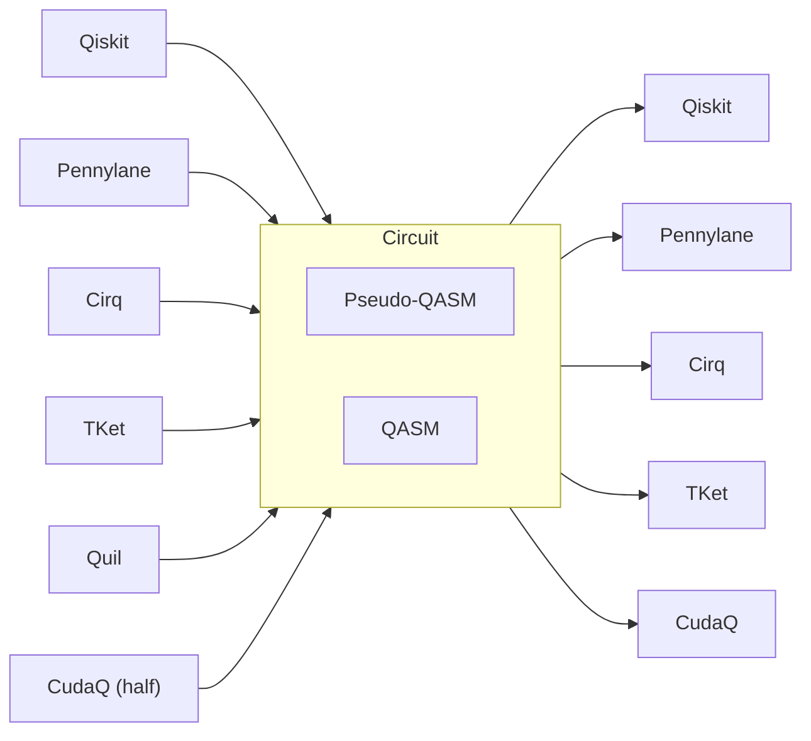

## abraxas


A tiny library to transpile quantum circuits. The goal is to speed up the time it takes to convert simple circuits across languages fast. Anything beyond a certain complexity should be written in the respective languages directly.

[Qiskit](https://qiskit.org/)
&bullet; [CudaQ](https://nvidia.github.io/cuda-quantum/latest/install.html)
&bullet; [Pennylane](https://docs.pennylane.ai/en/stable/code/qml.html)
&bullet; [Cirq](https://quantumai.google/cirq)
&bullet; [TKet](https://tket.quantinuum.com/)
&bullet; [Quil](https://pyquil.readthedocs.io/en/stable/)

## Install
```py
pip install abrax
```

## Examples
### toQiskit
```python
from qiskit import QuantumCircuit, Parameter
from abrax import toPenny, toQasm
import pennylane as qml

qc = QuantumCircuit(3)
p = Parameter('x')
qc.h([0, 1, 2])
qc.cx(0, 2)
qc.rx(0, 0)
qc.cx(1, 2)
qc.ry(p, 2)

qasm = toQasm(qc)
dev = qml.device("default.qubit", wires=2)
circuit = toPenny(qasm, dev) # pennylane needs 'dev'
# print(qml.draw(circuit)())
# 0: ──H─╭X──RX(0.00)───────────────┤  Probs
# 1: ──H─│────────────╭X────────────┤  Probs
# 2: ──H─╰●──X────────╰●──RY(x)─────┤  Probs
```

**Supported conversions**:


## Known Issues
- Don't parameterise 'exponent' in cirq for variational circuits. Else it will hard code in some random value. As a slow hack you can run the transpiler in a for loop everytime the exponent/rads change.
- Compiling "TO" pyquil isn't supported yet, I don't want to write a full generator loop
- CudaQ cannot do variational gates "toQasm" and writing a parser for QIR/MLIR is extremely expensive

## Supported Frameworks


