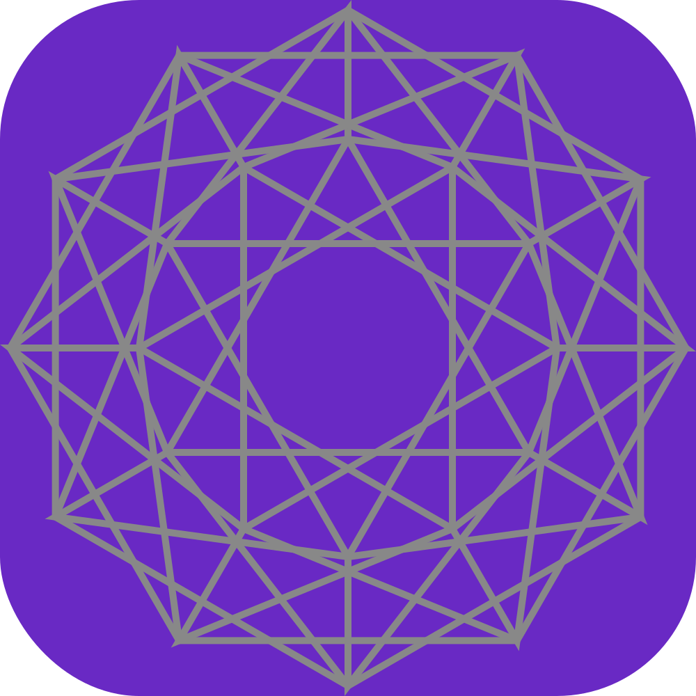
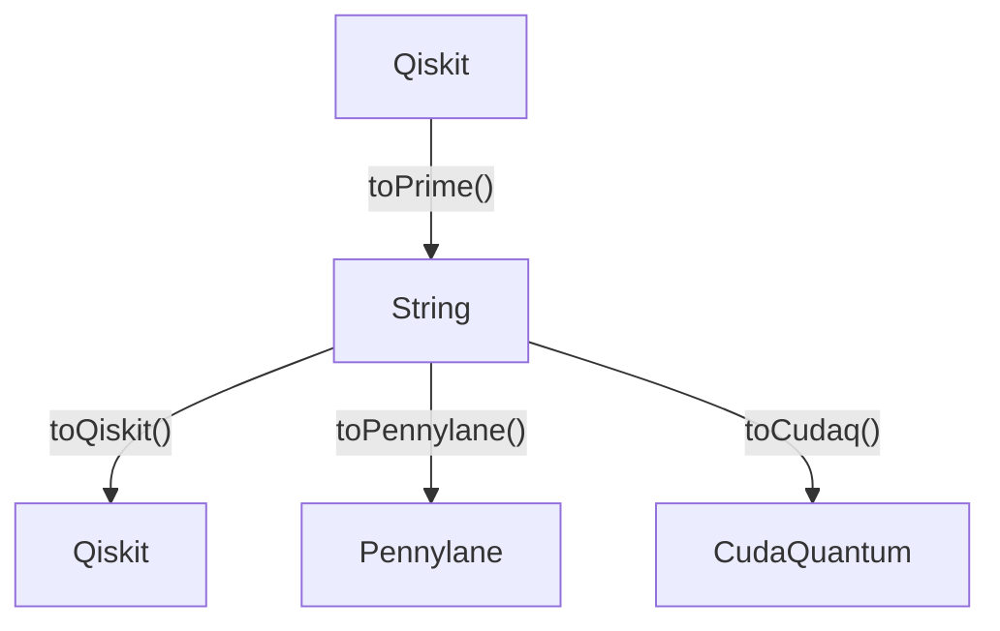

## abraxas



A tiny DSL to compile to quantum circuits. The goal is to speed up the time it takes to write small stupid circuits. Anything beyond a certain complexity should be written in the respective languages directlt directly.

[Qiskit](https://qiskit.org/) &bullet; [CudaQ](https://nvidia.github.io/cuda-quantum/latest/install.html) &bullet; [Pennylane](https://docs.pennylane.ai/en/stable/code/qml.html)

## Install
```py
pip install abrax
```

## Syntax
- Start with a `-` to denote a wire (you can also count `-0`, `-1`, `-2` as wires, these are just comments)
- All gates are case insensitive with NO SPACES BETWEEN GATE AND ARGUMENTS
- Arguments are in parenthesis `()` and separated by commas `,` ex: `H CX(2) CRX(3.1415,3)`
- Abraxas is only the circuit part parser. All the other gymnastics of creating circuits/allocating memory/running them is still up to you.

## Examples
### toQiskit
```python
from qiskit import QuantumCircuit
from abrax import toQiskit

qc = QuantumCircuit(3)
qc = toQiskit(qc, f"""
  - H CX(2) RX({3.1415})
  - H -     CX(2)
  - H X     RY(55)
  """
)

# IS THE SAME AS
#         ┌───┐┌───┐┌────────────┐
#    q_0: ┤ H ├┤ X ├┤ Rx(3.1415) ├────────────────
#         ├───┤└─┬─┘└────────────┘┌───┐
#    q_1: ┤ H ├──┼────────────────┤ X ├───────────
#         ├───┤  │      ┌───┐     └─┬─┘┌────────┐
#    q_2: ┤ H ├──■──────┤ X ├───────■──┤ Ry(55) ├─
#         └───┘         └───┘          └────────┘
```

### toPennylane
```python
import pennylane as qml
from abrax import toPennyLane

CIRC = f"""
- H CX(2) RX(θ1)
- H -     CX(2)
- H X     RY(θ2)
"""

maker, params = toPennylane(CIRC)
def circ():
  # 0.0, 0.1 since 2 params
  params = [0.1 * i for i in range(len(params))]
  maker(qml, params)

  return qml.probs()

circuit = qml.QNode(circ, qml.device('default.qubit', wires=3))
# IS THE SAME AS
# 0: ──H─╭X──RX(0.00)───────────────┤  Probs
# 1: ──H─│────────────╭X────────────┤  Probs
# 2: ──H─╰●──X────────╰●──RY(0.01)──┤  Probs
```

### toCudaq
```python
from cudaq import make_kernel, sample
from abrax import toCudaq

CIRC = f"""
-0 H CX(2) RX(θ1)
-1 H -     CX(2)
-2 H X     RY(θ2)
"""

kernel, thetas = make_kernel(list)
qubits = kernel.qalloc(3)

cudaO = {
  'kernel': kernel,
  'qubits': qubits,
  'quake': thetas,
  # this gets overwritten by the parser
  'params': 0,
}
kernel = toCudaq(cudaO, CIRC)
# expect 0.0, 0.1 since 2 params
vals = [0.1 * i for i in range(cudaO['params'])]
result = sample(kernel, vals)
print(result)
```

### toPrime
The prime string acts as a translation intermediate between various libraries. You can come to prime from Qiskit and go anywhere. (Coming to Prime from Pennylane/CudaQ is not supported yet)

```python
from qiskit.circuit.library import EfficientSU2
from abrax import toPrime

qc = EfficientSU2(3, reps=1).decompose()
string = toPrime(qc)

# IS THE SAME AS
# -0 ry(θ[0]) rz(θ[3]) cx(1)    ry(θ[6])
# -1 ry(θ[1]) rz(θ[4]) cx(2)    ry(θ[7])
# -2 ry(θ[2]) rz(θ[5]) ry(θ[8]) rz(θ[11])
```

You can now even take this string and pass into `toPennylane` or `toCudaq` to convert to run it in them. Ex.

```py
# string from above
maker, params = toPennylane(string)
def circ():
  # 12 params so 0.0, 0.1...1.1
  params = [0.1 * i for i in range(len(params))]
  maker(qml, params)

  return qml.probs()

circuit = qml.QNode(circ, qml.device('default.qubit', wires=3))
```

### Append
Abraxas can also add to an existing circuit since it takes in your circuit and simply appends to it. So you can pass in existing QuantumCircuit/CUDA Kernel, or add more operations in the Pennylane circ wrapper.

**Supported conversions**:
<!-- - `QuantumCircuit` -> `String`
- `String` -> `QuantumCircuit`
- `String` -> `CudaQ` -->
