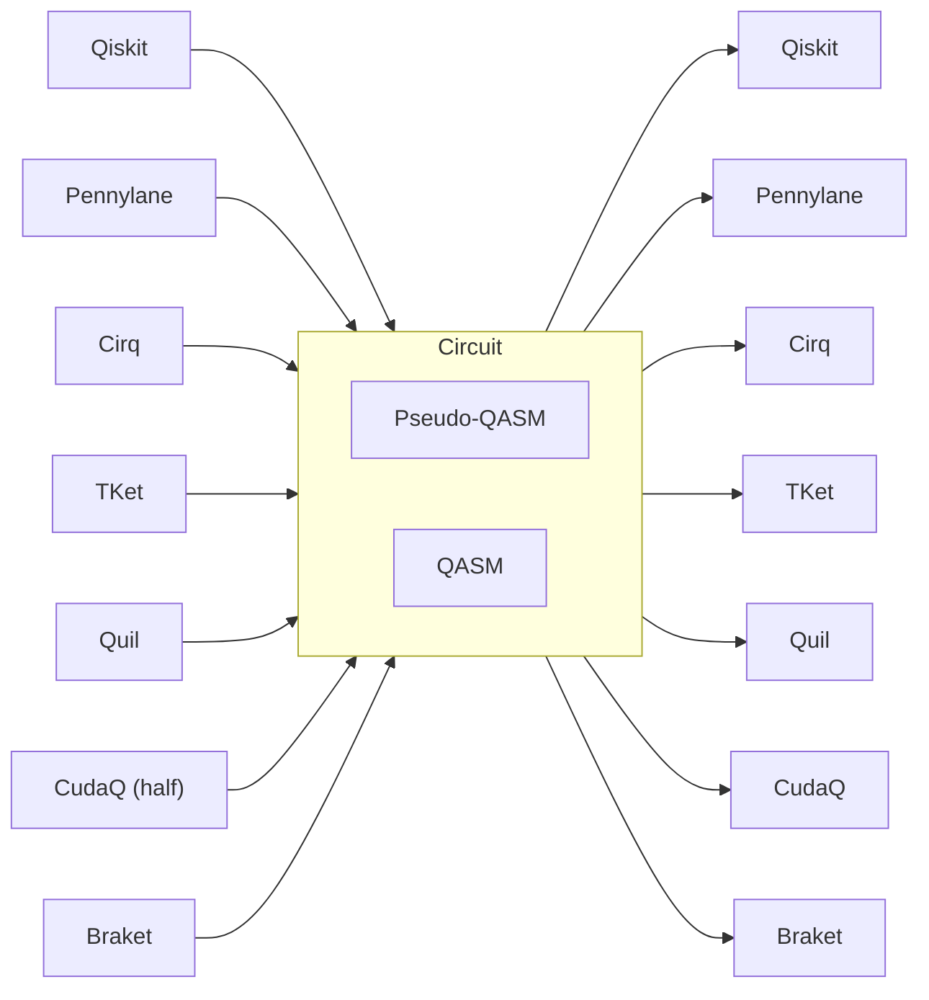
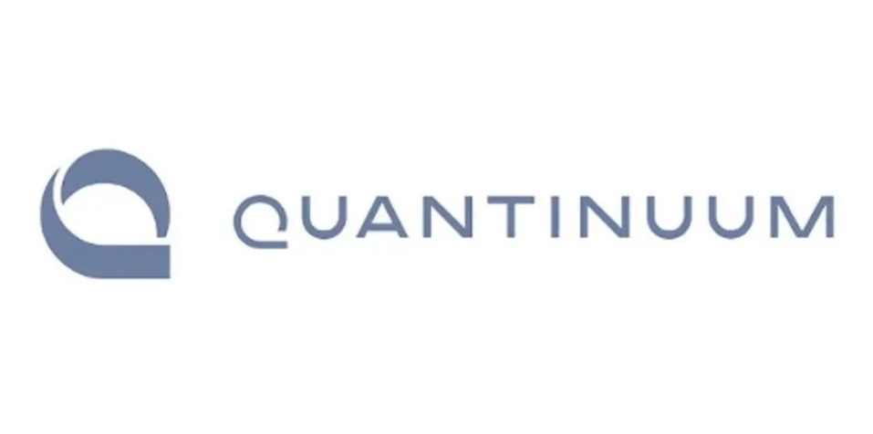
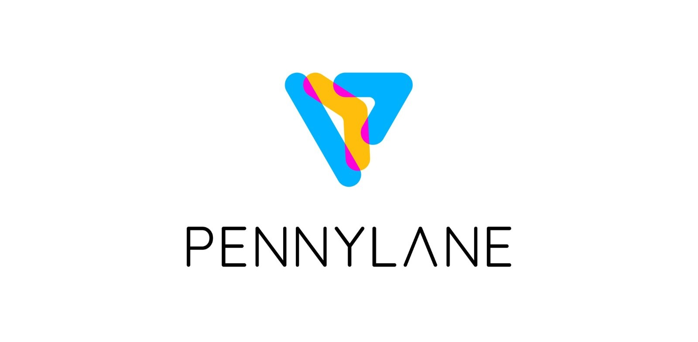
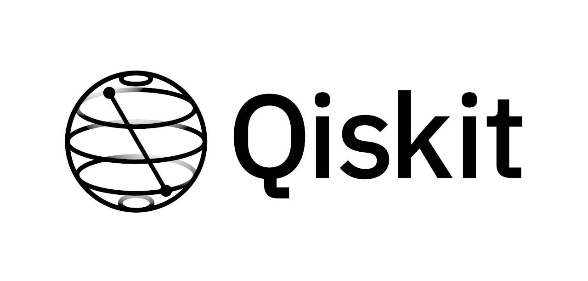
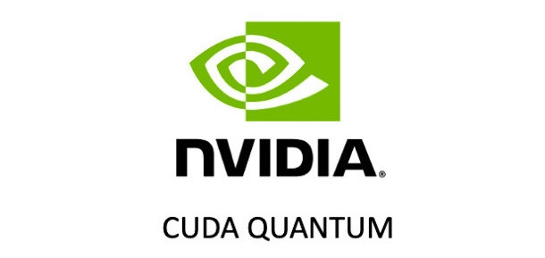

## abraxas


A tiny library to transpile quantum circuits. The goal is to speed up the time it takes to convert simple circuits across languages fast. Anything beyond a certain complexity should be written in the respective languages directly.

[Qiskit](https://qiskit.org/)
&bullet; [CudaQ](https://nvidia.github.io/cuda-quantum/latest/install.html)
&bullet; [Pennylane](https://docs.pennylane.ai/en/stable/code/qml.html)
&bullet; [Cirq](https://quantumai.google/cirq)
&bullet; [TKet](https://tket.quantinuum.com/)
&bullet; [Quil](https://pyquil.readthedocs.io/en/stable/)
&bullet; [Braket](https://aws.amazon.com/braket/)

## Install
Qiskit has also been marked as a dependency since about a third of the functions use it anyway.

```py
pip install abrax
```

## Examples
### toPennylane
```python
from qiskit import QuantumCircuit, Parameter
from abrax import toPenny, toQasm
import pennylane as qml

qc = QuantumCircuit(3)
p = Parameter('x')
qc.h([0, 1, 2])
qc.cx(0, 2)
qc.rx(0, 0)
qc.cx(1, 2)
qc.ry(p, 2)

qasm = toQasm(qc)
dev = qml.device("default.qubit", wires=2)
circuit = toPenny(qasm, dev) # pennylane needs 'dev'
# print(qml.draw(circuit)())
# 0: ──H─╭X──RX(0.00)───────────────┤  Probs
# 1: ──H─│────────────╭X────────────┤  Probs
# 2: ──H─╰●──X────────╰●──RY(x)─────┤  Probs
```

**Supported conversions**:


## Supported Frameworks

| | | |
|:-------------------------:|:-------------------------:|:-------------------------:|
||||
||||
||||