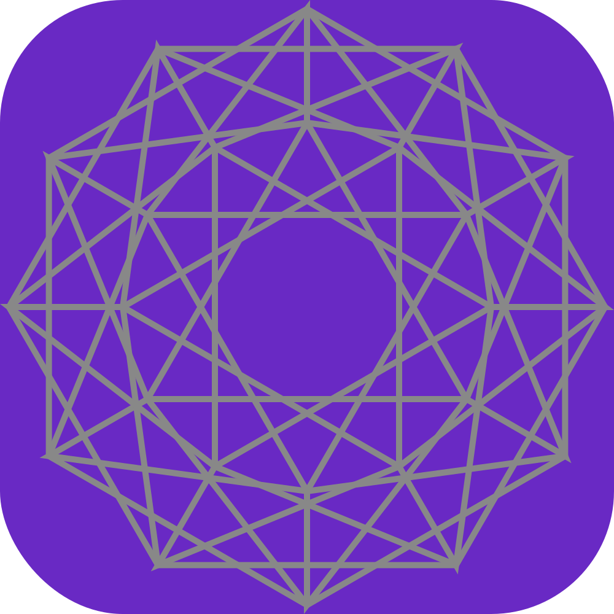
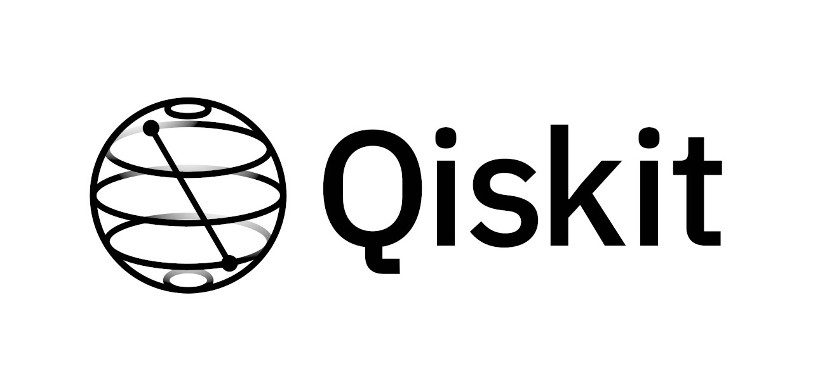
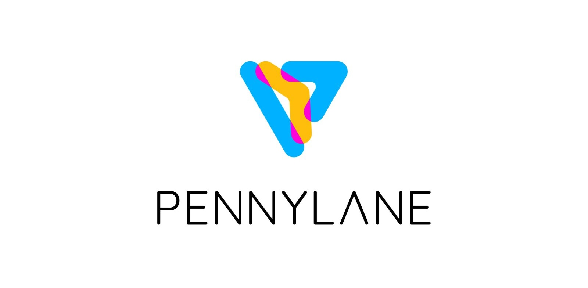
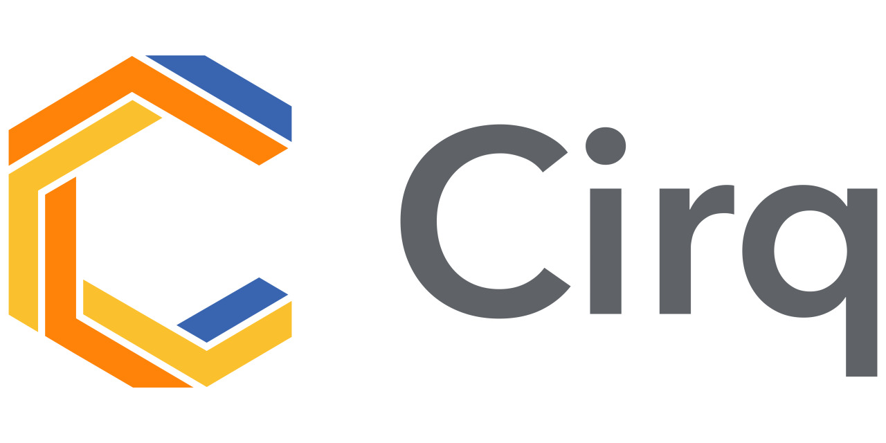
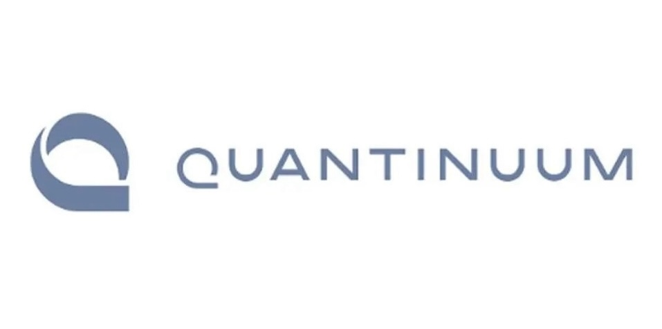
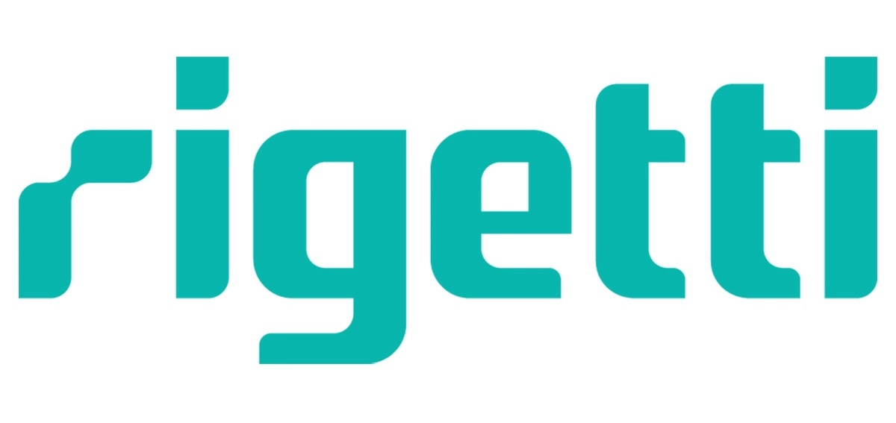
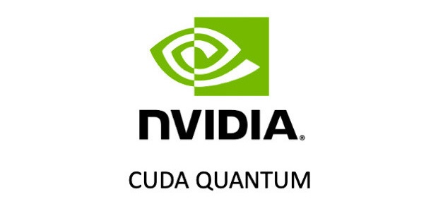

##  abraxas
A tiny library to transpile quantum circuits. The goal is to speed up the time it takes to convert simple circuits across languages fast. Anything beyond a certain complexity should be written in the respective languages directly.

[](https://badge.fury.io/py/abrax)

[Qiskit](https://qiskit.org/)
&bullet; [CudaQ](https://nvidia.github.io/cuda-quantum/latest/install.html)
&bullet; [Pennylane](https://docs.pennylane.ai/en/stable/code/qml.html)
&bullet; [Cirq](https://quantumai.google/cirq)
&bullet; [TKet](https://tket.quantinuum.com/)
&bullet; [Quil](https://pyquil.readthedocs.io/en/stable/)
&bullet; [Braket](https://aws.amazon.com/braket/)


## Install
While not explicity marked as required, it will be convenient to have `qiskit` installed since some functions use it to generate qasm code.

```py
pip install abrax
```

## Supported Frameworks

<div style="display:flex;flex-wrap:wrap">
  
  
  
  
  
  
  
</div>